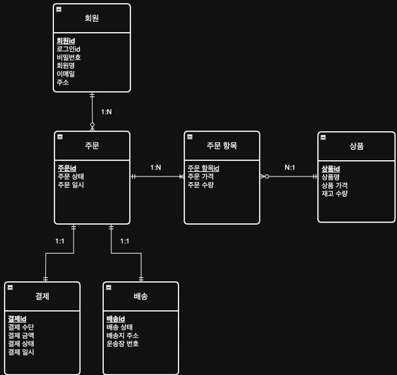

# 개념적 모델링 - 실습

## 1. 실전 요구 사항 분석

 - 회원 기능: 가입, 탈퇴, 여러 배송지 관리, 기본 배송지 설정 등
 - 판매자 기능
    - 누구나 우리 쇼핑몰에 입점해서 제품을 판매할 수 있는 오픈마켓
    - 외부 판매자 입점, 판매자별 상품 등록 및 관리, 판매자 정보 관리(상호명, 사업자번호), 판매자 정산 등
 - 상품 및 카테고리 기능: 상품 등록, 카테고리 관리, 가격/재고 변경 등
 - 장바구니 기능: 상품 담기, 수량 조절 등
 - 주문 기능: 장바구니에 담긴 여러 상품을 한 번에 주문, 배송지 선택, 쿠폰 적용, 주문 상태 관리 등
 - 결제 기능: 신용카드, 계좌이체 등 다양한 결제 수단 연동
 - 배송 기능: 배송 상태 추적(준비중, 배송중, 완료), 운송장 번호 관리
 - 리뷰 기능: 구매 완료 상품에 대한 별점 및 리뷰 작성

 

## 2. 실전 개념적 모델링 - 시작

### 2-1. 핵심 요구 사항 다시 정의하기 (MVP)

최소 기능 제품(MVP, Minimum Viable Product)를 정의하는 과정

 - __제외 기능__
    - 외부 판매자 기능: 제외. 1차 목표는 회사 상품을 온라인으로 판매하는 것
    - 쿠폰, 리뷰, 복잡한 카테고리: 해당 기능이 없어도 주문이 가능. 2차 오픈 기능으로 미룸
    - 장바구니 기능: 매우 중요하지만, 데이터베이스에 저장할 필요는 없음. 우선 애플리케이션이나 클라이언트 측에 임시 보관하도록 구현.
 - __쇼핑몰 MVP 기능 명세서__
    - 회원: 고객이 가입하고 자신의 정보를 관리
    - 상품: 우리가 판매할 상품 등록 및 관리
    - 주문: 회원이 상품울 구매
    - 결제: 주문에 대한 결제 정보 기록 및 관리
    - 배송: 결제가 완료된 주문의 배송 상태를 관리

 

### 2-2. 핵심 엔티티 도출

 - 회원(Member): 서비스를 사용하는 고객
 - 상품(Product): 판매의 대상이 되는 물건
 - 주문(Order): 회원의 구매 활동 결과
 - 결제(Payment): 주문에 대한 지불 정보
 - 배송(Delivery): 주문된 상품의 물리적 이동에 대한 정보
 - 주문은 결제까지 포함하는 비즈니스 트랜잭션 단위이고, 배송은 물류라는 별개의 프로세스로 분리

 

### 2-3. 속성 저의 및 관계 설정

 - 회원(Member): 회원ID, 로그인ID, 비밀번호, 회원명, 이메일, 주소
 - 상품(Product): 상품ID, 상품명, 상품가격, 재고수량
 - 주문(Order): 주문ID, 주문상태, 배송지 주소, 주문 일시
 - 결제(Payment): 결제ID, 결제수단, 결제금액, 결제상태, 결제일시
 - 배송(Delivery): 배송ID, 배송상태, 운송장 번호
 - __식별자 전략__: 단순화와 일관성을 위해 `엔티티명 + ID`를 사용
 - 관계
    - 회원과 주문 -> 한 명의 회원은 여러 번 주문할 수 있다. (1:N)
    - 주문과 결제 -> 하나의 주문에 대해 하나의 결제가 이루어진다. (1:1)
    - 주문과 배송 -> 하나의 주문에 대해 하나의 배송이 이루어진다. (1:1)
    - 주문과 상품 -> 하나의 주문에는 여러 상품이 포함될 수 있다. 반대로 하나의 상품도 여러 주문에 포함될 수 있다. (M:N)

 

### 2-4. M:N 관계 해소와 연관 엔티티

 - __다대다 관계 문제__
    - M:N 관계는 물리적으로 구현할 수 없다.
    - 관계에 속한 데이터를 저장할 장소가 없다.
 - __두 엔티티의 관계 속에서만 의미를 가지는 속성이 있는가?__
    - 어떤 회원이 A상품과 B상품을 하나의 주문서로 주문했을 때, A 상품을 몇개 주문 했는가?(주문 수량), A 상품을 얼마에 주문했는가?(주문 당시 가격) 정보가 필요하다.
    - 주문 수량: 주문 하나에는 상품이 여러 개일 수 있으니, 특정 상품의 수량을 저장할 수 없다.
    - 주문 당시 가격: 상품 엔티티에는 현재 상품 가격 정보가 있지만, 상품 가격은 언제든 바뀔 수 있다. 주문이 일어난 시점의 가격을 어딘가에 저장해야 한다.
 - __연관 엔티티 도입__
    - 주문과 주문 항목의 관계 (1:N)
        - 하나의 주문은 여러 개의 주문 항목을 가질 수 있다.
        - 하나의 주문 항목은 반드시 하나의 주문에 속한다.
    - 상품과 주문 항목의 관계 (1:N)
        - 하나의 상품은 여러 주문 항목에 포함될 수 있다.
        - 하나의 주문 항목은 반드시 하나의 상품을 가진다.

 

### 2-5. 연관 엔티티 추천 이름 및 특징

주문 항목(order_item)은 주문(order)과 상품(product)의 관계에서 나온 연관 엔티티다. 연관 엔티티의 이름을 지을 때는 크게 2가지 방법이 있다.

 - __연결 강조__
    - `주문 상품(order_product)`
        - 주문과 상품 테이블을 직접적으로 연결한다는 관계를 이름에 명시적으로 보여준다.
        - 매우 직관적이고 단순하여 관계를 파악하기 쉽다.
 - __의미 있는 이름__
    - `주문 항목(order_item)`
        - 주문에 포함된 항목이라는 의미를 가장 명확하게 전달한다.
        - 실제 쇼핑몰 비즈니스 로직과 용어가 일치하여 이해하기 쉽다.
    - `주문 상세(order_detail)`
        - 주문의 상세 내역이라는 의미로, order_item과 거의 동일한 의미로 널리 사용된다.
        - 주문에 속한 각 상품 정보를 상세히 나타낸다는 점을 강조한다.

 

## 3. 실전 개념적 모델링 - ERD 작성

    

 

### 3-1. ERD 설명

 - __회원과 주문 (1:N)__
    - 한 명의 회원은 여러 주문을 할 수 있다.
    - 회원 -> 주문 (선택적 관계): 주문하지 않은 회원도 존재할 수 있다.
    - 주문 -> 회원 (필수적 관계): 주문할 때 반드시 회원이 존재해야 한다.
 - __주문과 결제 (1:1)__
    - 하나의 주문은 반드시 하나의 결제를 가진다.
    - 주문 -> 결제 (필수적 관계): 주문시 결제가 필수다. 결제가 없는 임시 주문은 없다.
    - 결제 -> 주문 (필수적 관계)
 - __주문과 배송 (1:1)__
    - 주문, 결제, 배송의 책임을 분리함으로써 모델이 훨씬 명확해졌다.
    - 주문 -> 배송 (필수적 관계)
    - 배송 -> 주문 (필수적 관계)
 - __주문/상품과 주문 항목 (M:N)__
    - 주문과 상품은 주문 항목이라는 연관 엔티티를 통해 연결된다. 주문 항목은 주문 당시의 주문 가격과 주문 수량처럼 관계 속에서만 발생하는 중요한 정보를 저장하는 엔티티이다.
    - 주문 -> 주문 항목 (필수적 관계)
    - 주문 항목 -> 주문 (필수적 관계)
    - 상품 -> 주문 항목 (선택적 관계): 주문되지 않은 상품도 존재한다.
    - 주문 항목 -> 상품 (필수적 관계)

 

### 3-2. 개념적 모델링에서 외래 키를 생략한 이유

개념적 모델링에서는 외래 키를 표시하지 않는 것이 원칙이다. 하지만 실무에서는 종종 처음부터 외래 키를 포함하기도 한다.

 - __원칙: 특정 기술과 독립적인 설계__
    - 개념적 모델은 데이터의 구조와 관계를 큰 그림에서 이해하기 위한 설계도로 이 단계에서는 어떤 데이터베이스 기술을 사용할지 아직 결정하지 않았다고 가정한다.
    - `외래 키의 정체`: 외래 키는 테이블 간의 관계를 연결하기 위해 사용하는 관계형 데이터베이스 전용 기술이다.
    - `개념적 모델의 목표`: 특정 기술에 얽매이지 않는 순수한 데이터의 논리적 구조를 표현하는 것
    - `관계 표현 방식`: 개념적 모델에서는 외래 키 대신 선(Line)을 사용해 회원과 주문 같은 데이터 간의 관계를 표현한다.
    - `예시`: 주문 엔티티에 회원 ID라는 외래 키를 넣는 대신, 회원과 주문 이라는 두 개의 상자를 그리고 그 사이를 선으로 연결하여 "회원이 주문을 한다"는 관계를 보여주는 식이다.

## 4. 실전 개념적 모델링- 용어 사전 작성

### 4-1. 엔티티

| 분류      | 명칭    | 전체 영문명       | 축약어   | 설명                                             | 관련 시스템 요소        |
| ------- | ----- | ------------ | ----- | ---------------------------------------------- | ---------------- |
| **엔티티** | 회원    | `member`     | -     | 서비스를 이용하는 고객. `customer` 대신 `member`로 통일       | `member` 테이블     |
|         | 상품    | `product`    | -     | 판매하는 물건 또는 서비스                                 | `product` 테이블    |
|         | 주문    | `order`      | -     | 회원의 상품 구매 요청 행위. SQL 예약어이므로 테이블명은 `orders` 사용  | `orders` 테이블     |
|         | 주문 항목 | `order_item` | -     | 하나의 주문에 포함된 개별 상품 정보. 주문과 상품의 M:N 관계 해소 연관 엔티티 | `order_item` 테이블 |
|         | 배송    | `delivery`   | -     | 주문된 상품의 물리적 이동 정보                              | `delivery` 테이블   |
|         | 결제    | `payment`    | `pay` | 주문에 대한 지불 정보                                   | `payment` 테이블    |

### 4-2. 주요 속성

| 분류        | 명칭     | 전체 영문명        | 축약어    | 설명                                   | 예시                                             |
| --------- | ------ | ------------- | ------ | ------------------------------------ | ---------------------------------------------- |
| **주요 속성** | 식별자    | `identifier`  | `id`   | 데이터를 고유하게 식별하는 번호. `[엔티티명]_id` 형식 사용 | `member_id`, `product_id`                      |
|           | 이름, 명  | `name`        | -      | 사람, 상품 등을 지칭하는 명칭                    | `member_name`, `product_name`                  |
|           | 가격     | `price`       | -      | 상품의 현재 판매가 또는 주문 시점 가격               | `order_price`                                  |
|           | 금액     | `amount`      | -      | 총 주문 금액 등 금액 정보                      | `total_amount`                                 |
|           | 재고     | `stock`       | -      | 상품 재고 수량                             | `stock_quantity`                               |
|           | 수량     | `quantity`    | -      | 개수나 양                                | `stock_quantity`, `order_quantity`             |
|           | 개수, 횟수 | `count`       | -      | 이벤트 발생 횟수, 데이터 총 개수 등                | `visit_count`, `click_count`, `employee_count` |
|           | 상태     | `status`      | -      | 주문, 배송 등 엔티티 상태 값                    | `order_status`, `delivery_status`              |
|           | 주소     | `address`     | `addr` | 위치 정보. 회원 기본 주소, 주문 배송지 등            | `member.addr`, `orders.ship_addr`              |
|           | 비밀번호   | `password`    | -      | 로그인 시 사용하는 비밀번호                      | `member.password`                              |
|           | 배송     | `shipping`    | `ship` | 배송 관련 속성 접두사로 사용                     | `ship_addr`                                    |
|           | 로그인    | `login`       | -      | 시스템 접속 행위                            | `member.login_id`                              |
|           | 수단     | `method`      | -      | 예: 결제 수단                             | `pay_method`                                   |
|           | 번호     | `number`      | `no`   | 번호 (예: 운송장 번호)                       | `tracking_no`                                  |
|           | 운송장 번호 | `tracking_no` | -      | 배송 추적 번호                             | `tracking_no`                                  |

### 4-3. 행위/수식어

| 분류         | 명칭 | 전체 영문명   | 설명        | 예시           |
| ---------- | -- | -------- | --------- | ------------ |
| **행위/수식어** | 생성 | `create` | 데이터 생성 시점 | `created_at` |
|            | 수정 | `update` | 데이터 변경 시점 | `updated_at` |

### 4-4. 실무 팁 - 용어 사전은  살아있는 문서다.

용어 사전은 한 번 만들고 끝나는 문서가 아니다. 프로젝트가 진행되면서 새로운 용어가 추가되고 새로운 비즈니스 용어가 생겨날 때마다 지속적으로 업데이트되어야 한다. Confluence, Notion, Google Docs 등 팀원 모두가 쉽게 접근하고 편집할 수 있는 도구를 사용하여 살아있는 문서로 관리하는 것이 핵심이다.

