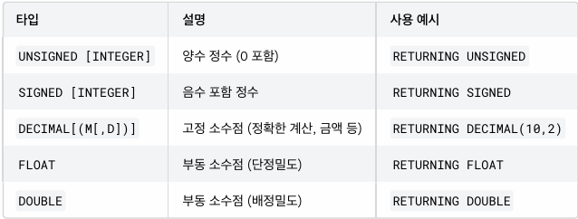
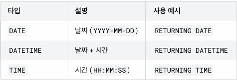
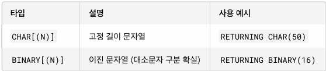

# JSON 설계

## 01. EAV의 한계와 JSON의 필요성

EAV(Entity-Arrtibute-Value) 패턴은 유연한 속성 관리가 가능하다는 장점이 있지만, 실무에서 사용하다보면 여러 가지 한계에 부딪히게 된다.

 - 복잡한 쿼리: EAV에서 상품 정보를 한 줄에 조회하려면 여러 행을 하나의 행으로 피벗해야 한다.
 - 데이터 타입 문제: EAV의 가장 큰 문제중 하나는 모든 값이 문자열로 저장된다는 것이다. 문자열 비교시 제대로 비교를 위해서는 형변환이 필요하다.
 - 성능 문제: 데이터가 늘어날수록 성능이 급격히 저하된다.
    - 상품 1개 속성이 10개라면, 상품 10만개에 속성은 100만 행이 된다.
```sql
CREATE TABLE product (
    product_id BIGINT PRIMARY KEY AUTO_INCREMENT,
    name VARCHAR(200) NOT NULL,
    category VARCHAR(100) NOT NULL,
    created_at DATETIME NOT NULL
);
CREATE TABLE product_attribute (
    attribute_id BIGINT PRIMARY KEY AUTO_INCREMENT,
    product_id BIGINT NOT NULL,
    attr_name VARCHAR(100) NOT NULL,
    attr_value VARCHAR(500) NOT NULL,
    FOREIGN KEY (product_id) REFERENCES product(product_id)
);

-- EAV에서 특정 속성들을 열로 변환하여 조회
SELECT 
    p.product_id,
    p.name,
    MAX(CASE WHEN pa.attr_name = 'screen_size' THEN pa.attr_value END) AS screen_size,
    MAX(CASE WHEN pa.attr_name = 'storage' THEN pa.attr_value END) AS storage,
    MAX(CASE WHEN pa.attr_name = 'color' THEN pa.attr_value END) AS color,
    MAX(CASE WHEN pa.attr_name = 'ram' THEN pa.attr_value END) AS ram
FROM product p
JOIN product_attribute pa ON p.product_id = pa.product_id
WHERE p.category = '스마트폰'
GROUP BY p.product_id, p.name;

-- 올바른 숫자 비교를 위한 형변환
SELECT p.name, pa.attr_value AS storage
FROM product p
JOIN product_attribute pa ON p.product_id = pa.product_id
WHERE pa.attr_name = 'storage'
  AND CAST(pa.attr_value AS UNSIGNED) >= 300;
```

### 1-1. JSON이 필요한 이유

EAV의 한계를 해결하기 위해 현대 관계형 데이터베이스들은 JSON 타입으 지원하기 시작했다.

 - __단순한 데이터 구조__: EAV는 속성 하나당 행 하나가 필요했지만, JSON은 하나의 컬럼에 모든 속성을 저장할 수 있다.
 - __네이티브 데이터 타입__: JSON에서는 숫자는 숫자로, 문자열은 문자열로, 불리언은 불리언으로 저장된다. 형변환 없이 올바른 비교가 가능하다.
 - __간단한 쿼리__: 피벗 쿼리 없이 JSON 함수만으로 데이터를 쉽게 추출할 수 있다.
```sql
-- JSON을 사용한 상품 테이블 (미리보기)
CREATE TABLE product_json (
    product_id BIGINT PRIMARY KEY AUTO_INCREMENT,
    name VARCHAR(200) NOT NULL,
    category VARCHAR(100) NOT NULL,
    attributes JSON, -- 여기에 저장
    created_at DATETIME NOT NULL
);
```
<br/>

2000년대 후반, MongoDB, CouchDB와 같은 문서 지향 데이터베이스들이 등장했다. 이들은 스키마 없이 유연하게 데이터를 저장할 수 있다는 점에서 많은 인기를 얻었다. 속성이 자주 변경되는 데이터, 중첩된 복잡한 뎅이터 구조, 빠른 개발과 프로토타이핑 등에 강점을 보인다.

JSON은 SQL:2016 표준에 공식적으로 포함되었다. JSON_VALUE, JSON_QUERY, JSON_TABLE 등의 함수가 표준으로 정의되었다. 다만 각 데이터베이스마다 구현 방식과 함수명에 차이가 있으므로, 사용하는 데이터베이스의 문서를 확인하는 것이 중요하다.

## 02. JSON 소개 및 문법

JSON(JavaScript Object Notation)은 데이터를 표현하는 경량 형식이다. 원래 JavaScript에서 시작되었지만, 지금은 거의 모든 프로그래밍 언어와 데이터베이스에서 지원하는 표준 데이터 형식이 되었다.

### 2-1. JSON의 기본 구조

 - __객체(Object)__
    - 중괄호 `{}`로 감싸며, 키-값 쌍으로 데이터를 표현한다.
    - 키는 반드시 큰따옴표로 감싼 문자열이어야 한다.
```json
{
    "name": "갤럭시 S24",
    "price": 1200000,
    "in_stock": true
}
```

 - __배열(Array)__
    - 대괄호 `[]`로 감싸며, 순서가 있는 값들의 목록을 표현한다.
```json
["빨강", "파랑", "초록"]
[1, 2, 3, 4, 5]
```
<br/>

### 2-2. JSON 데이터 타입

JSON은 6가지 데이터 타입을 지원한다.

 - __문자열__
    - 큰따옴표로 감싼다.
    - 작은 따옴표는 사용할 수 없다.
```json
{
    "product_name": "맥북 프로",
    "descript": "애플의 프로페셔널 노트북"
}
```

 - __숫자__
    - 정수와 실수 모두 표현 가능하다.
    - 따옴표 없이 작성한다.
```json
{
    "price": 2500000,
    "weight": 1.83,
    "discount_rate": 0.15
}
```

 - __불리언__
    - true 또는 false 값을 가진다.
    - 소문자로 작성하며, 따옴표를 사용하지 않는다.
```json
{
    "is_available": true,
    "is_discontinued": false
}
```

 - __null__
    - 값이 없음을 나타낸다.
    - 소문자로 작성한다.
```json
{
    "nickname": null,
    "secondary_phone": null
}
```

 - __객체__
    - 중첩된 객체를 값으로 가질 수 있다.
```json
{
    "product": {
        "name": "아이폰 15",
        "manufacturer": {
            "name": "Apple",
            "country": "미국"
        }
    }
}
```

 - __배열__
    - 값으로 배열을 가질 수 있으며, 배열 안에는 어떤 타입이든 들어갈 수 있다.
```json
{
    "colors": ["블랙", "화이트", "블루"],
    "specs": [
        {"name": "RAM", "value": 8},
        {"name": "Storage", "value": 256},
    ]
}
```

### 2-3. 실무에서 자주 사용하는 JSON 패턴

 - 상품 속성 표현, 다국어 지원 옵션과 변형, 메타데이터 등
```json
{
    "screen_size": 6.7,
    "storage": 256,
    "ram": 8,
    "color": "미드나잇",
    "5g_support": true,
    "release_date": "2026-03-15"
}

// 다국어 지원
{
    "name": {
        "ko": "무선 이어폰",
        "en": "Wireless Earbuds",
        "ja": "ワイヤレスイヤホン"
    }
}

// 옵션과 변형
{
    "variants": [
        {"color": "블랙", "size": "M", "stock": 50, "sku": "BLK-M-001"},
        {"color": "블랙", "size": "L", "stock": 30, "sku": "BLK-L-001"},
        {"color": "화이트", "size": "M", "stock": 45, "sku": "WHT-M-001"},
    ]
}

// 메타데이터
{
    "seo": {
        "title": "갤럭시 S24 울트라 - 최저가 구매",
        "description": "삼성 갤럭시 S24 울트라를 최저가로 만나보세요",
        "keywords": ["갤럭시", "S24", "울트라", "삼성"]
    },
    "analytics": {
        "view_count": 15420,
        "last_viewed": "2026-01-15T15:30:00Z"
    }
}
```

### 2-4. JSON 작성시 주의사항

 - __키는 반드시 큰따옴표 사용__
 - __마지막 요소 뒤에 쉼표 금지__
 - __주석 사용 불가__
 - __문자열 안의 특수문자__: 문자열 안에 큰따옴표나 역슬래시를 넣으려면 이스케이프`\` 처리가 필요하다.

<br/>

## 03. MySQL에서 JSON 사용하기

MySQL 5.7부터 JSON 타입을 지원하며, 8.0에서 많은 기능이 추가되었따.

 - __JSON 컬럼이 있는 테이블 생성__
```sql
-- JSON 컬럼이 있는 상품 테이블 생성
CREATE TABLE product_json (
    product_id BIGINT PRIMARY KEY AUTO_INCREMENT,
    name VARCHAR(200) NOT NULL,
    category VARCHAR(100) NOT NULL,
    attributes JSON,
    created_at DATETIME NOT NULL DEFAULT NOW()
);
```
<br/>

### 3-1. JSON 데이터 삽입

 - __문자열로 직접 삽입__
 - __JSON_OBJECT 함수 사용__: 키-값 쌍을 직접 지정할 수 있다.
 - __JSON_ARRAY 함수 사용__: 배열을 만들때 사용한다.
```sql
-- 1. 문자열로 직접 삽입
INSERT INTO product_json (name, category, attributes) VALUES
('갤럭시 S24', '스마트폰', 
'{"screen_size": 6.2, "storage": 256, "color": "팬텀 블랙", "ram": 8, "5g": true}');

-- 2. JSON_OBJECT 함수 사용
INSERT INTO product_json (name, category, attributes) VALUES
('아이폰 15 프로', '스마트폰',
 JSON_OBJECT(
    'screen_size', 6.1,
    'storage', 256,
    'color', '블랙 티타늄',
    'ram', 8,
    '5g', true
 ));

-- 3. JSON_ARRAY 함수 사용
INSERT INTO product_json (name, category, attributes) VALUES
('맥북 프로 16', '노트북',
 JSON_OBJECT(
    'screen_size', 16.2,
    'storage', 512,
    'color', '스페이스 그레이',
    'ram', 18,
    'ports', JSON_ARRAY('HDMI', 'USB-C', 'MagSafe', 'SD카드')
 ));
```

### 3-2. JSON 데이터 조회

 - __전체 JSON 조회__
```sql
SELECT name, attributes FROM product_json WHERE product_id = 1;
```

 - __JSON_EXTRACT 함수__
    - JSON에서 특정 경로의 값을 추출. 경로는 `$`로 시작한다. `"`이 포함된 값이 추출된다.
    - 숫자는 숫자 타입으로, 불리언은 불리언 타입으로 조회된다.
    - 추출한 값의 JSON 데이터 타입을 그대로 유지하여 반환한다.
    - `->` 연산자로 JSON_EXTRACT 함수를 축약할 수 있다.
```sql
-- JSON_EXTRACT 함수
SELECT
    name,
    JSON_EXTRACT(attributes, '$.screen_size') AS screen_size,
    JSON_EXTRACT(attributes, '$.storage') AS storage,
    JSON_EXTRACT(attributes, '$.color') AS color
FROM product_json
WHERE category = '스마트폰';

-- -> 연산자
SELECT 
    name,
    attributes->'$.screen_size' AS screen_size,
    attributes->'$.storage' AS storage,
    attributes->'$.color' AS color
FROM product_json
WHERE category = '스마트폰';
```

 - __JSON_VALUE 함수__
    - 추출한 값에서 따옴표를 제거하고, 별도의 타입을 지정하지 않으면 문자열로 반환한다.
    - `-->` 연산자로 JSON_VALUE 함수를 축약할 수 있다. 다만 이떄는 타입을 지정할 수 없으므로 단순히 문자 타입으로 값을 꺼낼 때 사용한다.
```sql
-- JSON_VALUE 함수 사용
SELECT
    name,
    JSON_VALUE(attributes, '$.screen_size') AS screen_size,
    JSON_VALUE(attributes, '$.storage') AS storage,
    JSON_VALUE(attributes, '$.color') AS color
FROM product_json
WHERE category = '스마트폰';

-- JSON_VALUE 반환 타입 지정
SELECT 
    name,
    JSON_VALUE(attributes, '$.storage') AS storage_text,
    JSON_VALUE(attributes, '$.storage' RETURNING UNSIGNED) AS storage,
    JSON_VALUE(attributes, '$.screen_size' RETURNING DECIMAL(4,2)) AS 
screen_size
FROM product_json
WHERE category = '스마트폰'
ORDER BY storage DESC;

-- --> 연산자
SELECT
    name,
    attributes->>'$.screen_size' AS screen_size,
    attributes->>'$.storage' AS storage,
    attributes->>'$.color' AS color
FROM product_json
WHERE category = '스마트폰';
```

 - __배열 요소 접근__
```sql
SELECT
    name,
    attributes->>'$.ports[0]' AS first_port,
    attributes->>'$.ports[1]' AS second_port
FROM product_json
WHERE category = '노트북';
```

 - __JSON 조건 검색__
    - JSON_CONTAINS 함수: 배열에 특정 값이 포함되어 있는지 확인할 때 사용한다. 문자열 검색시 큰따옴표를 포함해야 한다.
    - JSON_CONTAINS_PATH 함수: 특정 키가 존재하는지 확인할 떄 사용한다.
        - one: 여러 path 중 하나라도 존재하면 TRUE
        - all: 지정한 모든 path가 존재해야 TRUE
```sql
-- 1. 숫자 비교: 화면 크기가 6인치 이상인 제품 조회
SELECT name, attributes->'$.screen_size' AS screen_size
FROM product_json
WHERE attributes->'$.screen_size' >= 6;

-- 2. 문자열 비교: 블랙 색상 제품 조회
SELECT name, attributes->>'$.color' AS color
FROM product_json
WHERE attributes->>'$.color' LIKE '%블랙%';

-- 3. 불리언 비교: 노이즈 캔슬링 지원 제품 조회
SELECT name, category
FROM product_json
WHERE attributes->'$.noise_canceling' = true;

-- 4. JSON_CONTAINS로 배열 검색
-- USB-C 포트가 있는 노트북 조회
SELECT name, attributes->>'$.ports' AS ports
FROM product_json
WHERE JSON_CONTAINS(attributes->'$.ports', '"USB-C"');

-- 5. JSON_CONTAINS_PATH로 키 존재 확인
-- s_pen 속성이 있는 제품 조회
SELECT name, category, attributes->>'$.s_pen' AS s_pen
FROM product_json
WHERE JSON_CONTAINS_PATH(attributes, 'one', '$.s_pen');
```
<br/>

### 3-3. 데이터 수정

 - __JSON_SET 함수__
    - 키가 있으면 값을 수정하고, 없으면 새로 추가한다.
```sql
-- JSON_SET(json_doc, path, value [, path, value] ...)
-- json_doc: 대상 JSON 컬럼
-- path: JSON 경로
-- value: 설정할 값

-- 갤럭시 S24에 새로운 속성 추가
UPDATE product_json
SET attributes = JSON_SET(attributes, '$.wireless_charging', true, '$.storage', 1024)
WHERE product_id = 1;
```

 - __JSON_INSERT 함수__
    - 키가 없을 떄만 추가한다.
    - 이미 있는 키는 수정하지 않는다.
```sql
-- 이미 있는 color는 변경되지 않고, 없는 fast_charging만 추가됨
UPDATE product_json
SET attributes = JSON_INSERT(attributes, '$.color', '새로운 색상', '$.fast_charging', true)
WHERE product_id = 1;
```

 - __JSON_REPLACE 함수__
    - 키가 있을 떄만 수정한다.
    - 없는 키는 추가하지 않는다.
```sql
-- 있는 storage는 변경되고, 없는 new_feature는 추가되지 않음
UPDATE product_json
SET attributes = JSON_REPLACE(attributes, '$.storage', 256, '$.new_feature', true)
WHERE product_id = 1;
```

 - __JSON_REMOVE 함수__
    - 값을 삭제한다.
```sql
-- fast_charging 속성 삭제
UPDATE product_json
SET attributes = JSON_REMOVE(attributes, '$.fast_charging', '$.wireless_charging')
WHERE product_id = 1;
```

 - __JSON_ARRAY_APPEND 함수__
    - 배열에 요소를 추가한다.
```sql
-- 맥북에 새로운 포트 추가
UPDATE product_json
SET attributes = JSON_ARRAY_APPEND(attributes, '$.ports', '3.5mm 오디오')
WHERE product_id = 3;
```
<br/>

### 3-4. 유틸리티 함수

 __JSON_KEYS 함수__
    - 키 목록 조회
    - 키 목록을 배열로 반환한다.
```sql
-- ["5g", "ram", "color", "storage", "screen_size"]
SELECT name, JSON_KEYS(attributes) AS attribute_keys
FROM product_json
WHERE product_id = 1;
```

 - __JSON_LENGTH 함수__
    - 요소의 갯수를 확인한다.
```sql
-- 속성 개수 확인
SELECT name, JSON_LENGTH(attributes) AS attr_count
FROM product_json
LIMIT 5;

-- 배열 길이 확인
SELECT name, JSON_LENGTH(attributes->'$.ports') AS port_count
FROM product_json
WHERE category = '노트북';
```

 - __JSON_TYPE 함수__
    - 타입을 확인한다.
```sql
SELECT 
    name,
    JSON_TYPE(attributes->'$.screen_size') AS screen_type,
    JSON_TYPE(attributes->'$.color') AS color_type,
    JSON_TYPE(attributes->'$."5g"') AS `5g_type` -- 키가 숫자로 시작하면 따옴표로 감싸야 한다. 가급적 알파벳으로 시작하는게 좋다.
FROM product_json
WHERE product_id = 1;
```

 - __JSON_VALID 함수__
    - JSON 형식 유효성 검사
```sql
SELECT 
    JSON_VALID('{"name": "test"}') AS valid_json,
    JSON_VALID('{name: test}') AS invalid_json,
    JSON_VALID('not json at all') AS not_json;
```

 - __JSON_PRETTY__
    - 보기 좋게 출력
```sql
SELECT JSON_PRETTY(attributes) AS formatted_json
FROM product_json
```

 - __JSON_TABLE__
    - JSON 배열을 별도의 테이블처럼 펼칠 수 있다.
```sql
SELECT 
    p.name,
    p.base_price,
    v.sku,
    v.color,
    v.size,
    v.stock,
    (p.base_price + v.price_adjust) AS final_price
FROM product_variant p,
JSON_TABLE(p.variants, '$[*]' COLUMNS (
    sku VARCHAR(50) PATH '$.sku',
    color VARCHAR(50) PATH '$.color',
    size INT PATH '$.size',
    stock INT PATH '$.stock',
    price_adjust INT PATH '$.price_adjust'
)) AS v;

-- 특정 조건의 옵션 찾기
-- 재고가 10개 이하인 옵션 찾기
SELECT 
    p.name,
    v.sku,
    v.color,
    v.size,
    v.stock
FROM product_variant p,
JSON_TABLE(p.variants, '$[*]' COLUMNS (
    sku VARCHAR(50) PATH '$.sku',
    color VARCHAR(50) PATH '$.color',
    size INT PATH '$.size',
    stock INT PATH '$.stock'
)) AS v
WHERE v.stock <= 10;

-- 색상별 총 재고 집계
SELECT 
    p.name,
    v.color,
    SUM(v.stock) AS total_stock,
    COUNT(*) AS size_count
FROM product_variant p,
JSON_TABLE(p.variants, '$[*]' COLUMNS (
    color VARCHAR(50) PATH '$.color',
    stock INT PATH '$.stock'
)) AS v
GROUP BY p.name, v.color;
```

## 3-5. DB 데이터 타입

 - __숫자형(Numeric Types)__

<div align="center">
    
</div>
<br/>

 - __날짜 및 시간형(Date and Time Types)__

<div align="center">
    
</div>
<br/>


 - __문자열 및 바이너리(String and Binary Types)__

<div align="center">
    
</div>
<br/>

## 4. JSON 인덱스와 성능 최적화

JSON은 스키마 없는 유연함을 제공하지만, 데이터가 쌓였을 떄의 성능 문제는 반드시 고민해야 한다.

### 4-1. 가상 컬럼(Virtual Column)을 활용한 인덱스

MySQL 5.7부터 지원하는 가상 컬럼을 사용하면 JSON 내부의 특정 필드를 마치 별도의 컬럼처럼 추출하고, 여기에 인덱스도 걸 수 있다.

 - 가상 커럶에는 계산식(메타데이터)만 저장한다. DB가 이 컬럼을 읽어야 할 떄마다 원본 JSON을 참조해서 값을 그때그때 계산해서 보여준다.
    - 저장 공간 절약: 데이터를 중복해서 저장하지 않으므로 디스크 공간을 아낄 수 있다.
    - 데이터 무결성 유지: 원본 JSON 데이터가 변경되면 가상 컬럼의 값도 자동으로 변경된다.
```sql
-- 1. 가상 컬럼 생성
-- GENERATED ALWAYS AS (...): 괄호 안의 식을 통해 값이 자동으로 생성된다는 뜻이다.
-- VIRTUAL:이 컬럼은 실제로 디스크에 저장되지 않고, 조회할 때만 계산된다. 따라서 추가적인 저장 공간을 거의 차지하지 않는다.
ALTER TABLE product_json
ADD COLUMN v_storage INT GENERATED ALWAYS AS (attributes->'$.storage') VIRTUAL;

-- 2. 가상 컬럼에 인덱스 생성
CREATE INDEX idx_v_storage ON product_json(v_storage);

-- 3. 성능 개선 확인
-- type: ref: 풀 테이블 스캔이 사라지고 인덱스를 타게 되었다.
-- key: idx_v_storage: 우리가 만든 인덱스가 사용되었다.
EXPLAIN
SELECT * FROM product_json WHERE v_storage = 256;

-- JSON 경로로 조회해도 인덱스 적용됨
EXPLAIN
SELECT * FROM product_json
WHERE attributes->'$.storage' = 256;
```

 - __VIRTUAL vs STORED__
    - VIRTUAL
        - 기본값으로 생략 가능
        - 데이터를 디스크에 저장하지 않는다. (메타데이터만 저장)
        - INSERT나 UPDATE 시에는 계산하지 않고, 데이터를 SELECT 할 떄마다 CPU가 계산해서 보여준다.
        - 저장 공간을 차지하지 않아 효율적이다.
    - STORED
        - 데이터를 디스크에 물리적으로 저장한다.
        - INSERT나 UPDATE 될 떄 미리 계산해서 저장해둔다.
        - 저장 공간을 추가로 차지하지만, 읽을 떄 CPU 연산이 필요하다.
    - 실무에서는 VIRTUAL를 선호
        - VIRTUAL 컬럼에 인덱스를 걸면, 그 인덱스 정보는 디스크에 물리적으로 저장된다.
        - 우리가 `idx_v_storage` 인덱스를 만드는 순간, 이미 `storage` 값들이 B-Tree 형태로 디스크에 예쁘게 정렬되어 저장된다. 따라서 인덱스를 통해 조회할 떄는 매번 계산하는 것이 아니라, 이미 저장된 인덱스 값을 바로 찾아가므로 STORED와 성능 차이가 거의 없다. 오히려 STORED를 사용하면 중복 낭비가 발생한다. (JSON 원본 데이터의 STORED 값이 있는데 가상 컬럼에도 값을 저장하고, 인덱스에도 데이터를 저장)
        - STORED 방식은 JSON 추출 비용보다 훨씬 더 복잡하고 무거운 계산이 필요하거나, 해당 컬럼을 PK로 설정해야 하는 등 제약 사항이 있을 떄만 제한적으로 사용한다. 일반적인 JSON 필드 인덱싱 목적이라면 VIRTUAL 만으로 충분하다.
<br/>

### 4-2. 함수 기반 인덱스 (Function-Based Index)

가상 컬럼 방식은 매우 유용하지만, 인덱스 하나를 만들기 위해 컬럼을 추가하고 다시 인덱스를 생성해야 하는 과정이 다수 번거롭게 느껴질 수 있다. MySQL 8.0.13 버전부터는 가상 컬럼을 명시적으로 만들지 않고도, 함수(수식)의 결과에 대해 직접 인덱스를 생성할 수 있는 함수 기반 인덱스 기능을 지원한다.

 - 문법은 간단하다. 인덱스를 생성할 떄 컬럼명 대신 `(수식)`을 이중 괄호로 감싸서 넣어주면 된다.
    - `(( ... ))`: 수식을 인덱스로 사용할 떄는 반드시 이중 괄호를 사용해야 한다.
    - 타입을 지정해야 한다. (인덱스는 사용할 타입을 알아야 한다.)
```sql
-- 1. 함수 기반 인덱스 생성
-- 가상 컬럼 생성 과정 없이 바로 인덱스 생성
CREATE INDEX idx_func_storage
ON product_json (( CAST(attributes->'$.storage' AS UNSIGNED) ));

-- 가상 컬럼 생성 과정 없이 바로 인덱스 생성 (CAST 없음)
CREATE INDEX idx_func_storage
ON product_json ((JSON_VALUE(attributes, '$.storage' RETURNING UNSIGNED)));

-- 2. 실행 결과 확인
EXPLAIN
SELECT * FROM product_json
WHERE attributes->'$.storage' = 256;
```
<br/>

### 4-3. 멀티 밸류 인덱스(Multi-Valued Index)

가상 컬럼 인덱스는 값이 하나인 경우에는 완벽하다. 하지만 기존 B-Tree 인덱스는 하나의 행에 하나의 인덱스 키만 가질 수 있어서 배열을 인덱싱 할 수 없었다.

MySQL 8.0.17부터 도입된 멀티 밸류 인덱스는 하나의 행(JSON 배열)에 여러 개의 인덱스 키를 매핑할 수 있게 해준다.

 - __1. 멀티 밸류 인덱스 생성__
    - `CAST(... AS ... ARRAY)`: JSON 배열의 요소들을 지정한 타입으로 변환하여 인덱싱
    - 이중 괄호 `(( ... ))`를 사용해야 한다.
 - __2. 멀티 밸류 인덱스 활용 함수__
    - `MEMBER OF()`: 특정 값이 배열에 있는지 확인
    - `JSON_CONTAINS()`: 특정 JSON이 포함되어 있는지 확인
    - `JSON_OVERLAPS()`: 두 배열 간에 겹치는 요소가 있는지 확인
```sql
-- 1. 멀티 밸류 인덱스 생성
-- ports 배열에 대한 멀티 밸류 인덱스 생성
CREATE INDEX idx_ports
ON product_json (( CAST(attributes->'$.ports' AS CHAR(20) ARRAY) ));

-- 2. 성능 개선 확인
-- HDMI 포트가 있는 제품 검색
EXPLAIN
SELECT product_id, name, attributes->>'$.ports'
FROM product_json
WHERE 'HDMI' MEMBER OF(attributes->'$.ports');

EXPLAIN
SELECT product_id, name
FROM product_json
WHERE JSON_CONTAINS(attributes->'$.ports', '"USB-C"');
```
<br/>

### 4-4. JSON 인덱스 정리

 - __인덱스 핵심__
    - 가상 컬럼 + 인덱스로 JSON 값 검색 최적화
    - 함수 기반 인덱스로 가상 컬럼없이 인덱스 생성 가능 (MySQL 8.0.13+)
    - Multi-Valued Index로 JSON 배열 검색 최적화 (MySQL 8.0.17+)
 - __성능 최적화 전략__
    - 자주 검색하는 속성은 가상 컬럼으로 추출하여 인덱스 적용
    - 하이브리드 설계: 검색용 속성은 일반 컬럼, 유동적 속성은 JSON
    - JSON 크기를 적절히 유지
    - 전체 교체 대신 부분 업데이트 활용
<br/>

## 5. JSON 설계의 장단점과 한계

 - __JSON 설계 장점__
    - 스키마 유연성: 스키마 변경 없이 새로운 속성을 추가할 수 있다.
    - 복잡한 중첩 구조 표현: 관계형 모델에서는 여러 테이블로 분리해야 하는 중첩 구조를 하나의 컬럼에 표현할 수 있다.
    - 개발 생산성 향상: 애플리케이션에서 객체나 JSON을 그대로 저장하고 조회할 수 있어 개발이 단순해진다.
```sql
CREATE TABLE product_flex (
    product_id BIGINT PRIMARY KEY AUTO_INCREMENT,
    name VARCHAR(200) NOT NULL,
    category VARCHAR(100) NOT NULL,
    attributes JSON,
    created_at DATETIME NOT NULL DEFAULT NOW()
);
```

 - __JSON 설계 단점__
    - 데이터 무결성 부재: 스키마가 없으므로 데이터베이스 수준에서 데이터 무결성을 보장하지 않는다.
        - CHECK 제약 조건으로 일부 보완: MySQL 8.0.16부터 JSON에 CHECK 제약조건을 사용할 수 있다.
    - 참조 무결성 불가: JSON 내부의 값으로는 외래 키를 설정할 수 없다.
    - 집계와 분석 어려움: JSON 데이터의 데핸 집계 쿼리는 복잡하고 성능이 떨어진다.
        - 파싱 오버헤드: JSON은 매 행마다 JSON 문서를 열고, 내부 구조를 순회하여 키를 찾는다.
        - 데이터 용량과 I/O: JSON은 값뿐만 아니라 키 정보도 함꼐 저장한다. 떄문에 훨씬 많은 저장 공간을 차지하며, 분석을 위해 대량의 데이터를 메모리로 로드할 떄, 불필요한 키 정보까지 함꼐 읽어야 하므로 디스크 I/O와 메모리 효율이 떨어진다.
```sql
CREATE TABLE product_validated (
    product_id BIGINT PRIMARY KEY AUTO_INCREMENT,
    name VARCHAR(200) NOT NULL,
    attributes JSON NOT NULL,-- JSON 유효성 검사
    CONSTRAINT chk_brand CHECK (JSON_CONTAINS_PATH(attributes, 'one', '$.brand')),
    CONSTRAINT chk_price CHECK (
        JSON_CONTAINS_PATH(attributes, 'one', '$.price') 
        AND JSON_TYPE(attributes->'$.price') = 'INTEGER'
    )
);
```
<br/>

## 6. JSON 사용 가이드라인

### 6-1. JSON을 사용하면 좋은 경우

 - __카테고리마다 속성이 다른 경우__
    - 전자제품, 의류, 식품 등 카테고리별로 완전히 다른 속성
        - 스마트폰: screen_size, ram, battery
        - 의류: size, color, material
        - 식품: calories, ingredients, allergens
 - __속성이 자주 변경되거나 추가되는 경우__
    - 비즈니스 요구사항에 따라 새로운 속성이 계속 추가되는 경우
    - 매번 ALTER TABLE을 할 수 없는 상황
 - __스키마를 예측할 수 없는 경우__
    - 사용자 정의 필드
    - 외부 API 응답 저장
    - 설정 데이터
 - __데이터 스냅샷 저장__
    - 주문 시점의 상품 정보
    - 이력 데이터

<br/>

### 6-2. JSON을 사용하면 안 좋은 경우

 - __자주 검색하고 정렬하는 데이터__
    - 가격으로 자주 정렬하고 필터링한다면 일반 컬럼이 좋다.
 - __집계와 분석이 필요한 데이터__
    - 통계, 리퐅, 대시보드용 데이터
    - SUM, AVG, GROUP BY 등을 자주 사용
 - __참조 무결성이 중요한 데이터__
    - 다른 테이블과의 관계가 중요한 경우
    - 외래 키 제약이 필요한 경우
 - __트랜잭션 무결성이 중요한 데이터__
    - 금융 데이터
    - 재고 수량
    - 핵심 비즈니스 데이터
 - __데이터 일관성이 중요한 경우__
    - 모든 레코드가 동일한 구조를 가져야 하는 경우
    - 필수 필드 검증이 필요한 경우

<br/>

### 6-3. 실무 설계 패턴

 - __하이브리드 패턴__
    - 핵심 속성은 일반 컬럼, 부가 속성은 JSON으로 분리
```sql
CREATE TABLE product_best_practice (
    product_id BIGINT PRIMARY KEY AUTO_INCREMENT,
    
    -- 핵심 속성: 일반 컬럼 (검색, 정렬, 집계에 사용)
    name VARCHAR(200) NOT NULL,
    category VARCHAR(100) NOT NULL,
    brand VARCHAR(100) NOT NULL,
    price INT NOT NULL,
    stock INT NOT NULL DEFAULT 0,
    status VARCHAR(20) NOT NULL DEFAULT 'active',
    
    -- 부가 속성: JSON (카테고리별로 다른 속성)
    attributes JSON,
    
    -- 메타데이터: JSON (SEO, 분석 등)
    metadata JSON,
    created_at DATETIME NOT NULL DEFAULT NOW(),
    updated_at DATETIME NOT NULL DEFAULT NOW() ON UPDATE NOW(),
    
    -- 일반 컬럼 인덱스
    INDEX idx_category (category),
    INDEX idx_brand (brand),
    INDEX idx_price (price),
    INDEX idx_status (status),
    INDEX idx_category_brand_price (category, brand, price)
);
```
<br/>

## 7. 관계형 데이터베이스 vs NoSQL

### 7-1. 주요 차이점 비교

 - __데이터 모델__
    - __관계형 DB__
        - 테이블, 행, 열로 구성
        - 정규화된 스키마
        - 관계(JOIN)로 데이터 연결
        - 스키마 변경에 ALTER TABLE 필요
    - __NoSQL (Mongo DB)__
        - 컬렉션, 문서로 구성
        - 유연한 스키마
        - 임베딩 또는 참조로 데이ㅓㅌ 연결
        - 스키마 변경이 자유로움
 - __트랜잭션 일관성__
    - __관계형 DB__
        - 강력한 ACID 트랜잭션
        - 다중 테이블 트랜잭션 지원
        - 강한 일관성 보장
    - __NoSQL (Mongo DB)__
        - 기본적으로 단일 문서 원자성
        - 다중 문서 트랜잭션은 제한적으로 지원
        - 최종 일관성 모델
 - __확장성__
    - __관계형 DB__
        - 수직 확장(Scale-up) 중심
        - 수평 확장(Sharding)은 복잡한
        - 읽기 확장은 복제로 가능
    - __NoSQL (Mongo DB)__
        - 수평 확장(Scale-out) 용이
        - 내장된 샤딩 지원
        - 분산 환경에 최적화
 - __쿼리 능력__
    - 복잡한 JSON과 집계는 관계형 DB가 더 강력하다.
```
-- 관계형 DB: 강력한 SQL
SELECT p.name, c.category_name, SUM(o.quantity) as total_sold
FROM products p
JOIN categories c ON p.category_id = c.category_id
JOIN order_items o ON p.product_id = o.product_id
WHERE o.order_date >= '2026-01-01'
GROUP BY p.product_id
HAVING total_sold > 100
ORDER BY total_sold DESC;

// MongoDB: 집계 파이프라인
db.orders.aggregate([
    { $match: { order_date: { $gte: ISODate("2026-01-01") } } },
    { $unwind: "$items" },
    { $group: { _id: "$items.product_id", total_sold: { $sum: "$items.quantity" } } },
    { $match: { total_sold: { $gt: 100 } } },
    { $sort: { total_sold: -1 }}
])
```
<br/>

### 7-2. 언제 무엇을 선택할까

 - __관계형 DB가 좋은 경우__
    - 데이터 일관성이 중요한 경우
    - 복잡한 관계와 JOIN이 필요한 경우
    - 기존 관계형 인프라가 있는 경우
    - 부분적인 스키마 유연성만 필요한 경우
 - __NoSQL이 더 좋은 경우__
    - 스키마가 매우 유동적인 경우
        - 속성이 수시로 변경됨
        - 문서마다 구조가 완전히 다름
        - 개발 초기 단계로 스키마가 불확실
    - 대규모 수평 확장이 필요한 경우
        - 데이터가 TB, PB 단위로 성장
        - 여러 서버에 분산 저장 필요
        - 지역별 분산 배치 필요

<br/>

### 7-3. 하이브리드 아키텍처

실무에서는 하나만 선택하지 않고, 용도에 맞게 여러 데이터베이스를 함꼐 사용하는 경우가 많다.

 - __MySQL (관계형)__
    - 주문, 결제, 재고 (트랜잭션 중요)
    - 회원 정보 (일관성 중요)
    - 상품 기본 정보 + JSON 속성
 - __MongoDB (문서형)__
    - 상품 리뷰 (유연한 구조)
    - 로그, 이벤트 데이터 (대용량)
    - 개인화 추천 데이터
 - __Redis (키-값)__
    - 세션 저장
    - 캐시
    - 실시간 순위
 - __ElasticSearch__
    - 상품 검색
    - 로그 분석

<br/>

### 7-4. 실무 조언

실무에서 마주하는 프로젝트의 95% 이상은 MySQL이나 PostgreSQL 같은 관계형 데이터베이스 하나만으로도 충분하다.

데이터 구조가 자주 바뀌어서 유연성이 필요하다면 관계형 데이터베이스의 JSON 타입을 활용하면 된다. 핵심 비즈니스 데이터는 견고한 테이블에 저장하고, 가변적인 속성만 JSON 컬럼에 저장하는 하이브리드 전략을 사용하면 유연성 문제의 대부분이 해결된다.

NoSQL을 섣불리 도입하지 말아야 하는 진짜 이유는 운영 복잡도 떄문이다. 시스템에 새로운 종류의 데이터베이스가 하나 추가된다는 것은 단순히 코드를 조금 더 짜는 문제가 아니다.

 - 팀원 모두가 해당 기술을 새로 배워야 한다.
 - 모니터링해야 할 서버와 지표가 늘어난다.
 - 백업과 복구 전략을 별도로 수립해야 한다.
 - 장애가 발생했을 떄 트러블슈팅할 수 있는 전문가가 필요하다.
